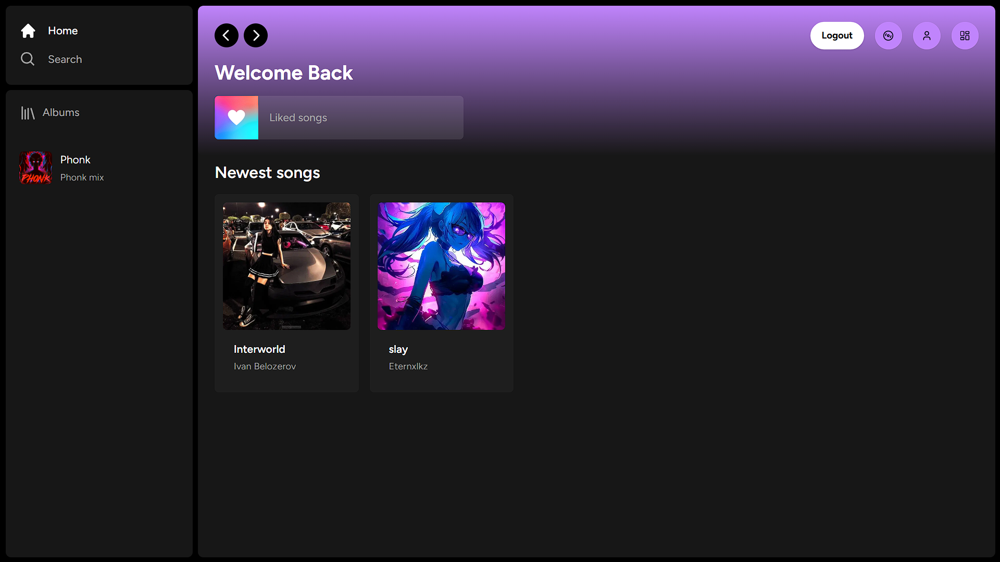

# Harmoic - A music streaming platform



Harmonic is a music streaming platform that allows users to create rooms where members can listen to songs together. The host has control over music playback, and members can chat with each other.

    

## 🔮 Features

-   🎧 Seamless music streaming experience, allowing users to listen to songs from a vast library.
-   🎵 Music room creation, enabling users to listen to songs together.
-   📁 Admin users can upload songs and manage playlists for organizing favorite tracks.
-   🔍 Advanced search functionality enabling users to easily find songs.
-   🔄 Continuous playback ensuring smooth transitions between tracks.
-   📱 Responsive design all users to access the application on any device
-   🔐 Secure authentication and authorization system.

## 🚀 Live Preview

You can view the live preview of the project [here](https://harmonic-music.vercel.app/).

## 💻 Tech Stack

            


## ⚙️ **Installation**  

### **1️⃣ Clone the repository:**  

```bash
git clone https://github.com/Nikeshchaudhary52494/Harmonic.git
```

### **2️⃣ Set up environment variables**  

#### **Frontend `.env` (main-app)**
   Create or edit the .env file and add the following line:  
   
    ```bash
        DATABASE_URL
        JWT_SECRET
        CLOUDINARY_API_SECRET
        CLOUDINARY_API_KEY
        NEXT_PUBLIC_CLOUDINARY_CLOUD_NAME
        SOCKET_SITE_URL
        NEXT_PUBLIC_ADMIN_EMAIL
    ```
#### **Backend `.env` (websocket-server)**

    ```bash
        NEXT_PUBLIC_SITE_URL
    ```

4. **Install dependencies:**
   Navigate to the root folder run:
    ```bash
     npm install && npx prisma generate && npx prisma db push
    ```
5. **Start the server:**  
    ```bash
    npm run dev
    ```
6. **Access the application:**
   Open a browser and enter the following URL:
    ```bash
    http://localhost:3000/
    ```

## 🌟 Support Us

If you find this helpful or valuable, please consider 🌟 starring the repository. It helps us gain visibility and encourages further development. We appreciate your support!


